<p align="center">
  <a href="https://github.com/PauGarzon123/Proyecto-Arduino/graphs/contributors">
    
  </a>
</p>

# Proyecto‑Simulación satelital

## Descripción  
Proyecto basado en Arduino que simula un sistema satelital formado principalmete por 2 partes:  
-Un satelite simulado  
-Una estación tierra

En el proyecto el satelite se encarga de recoger datos como la humedad, distancia o temperatura.  
Este los envia a la estación tierra donde los muestra al usuario mediante una interfaz grafica.

Esta interfaz además permite hacer cambios en la toma de datos como por ejemplo un cambio de direccion en el radar.
Este cambio se transmite de tierra al satélite para que pueda realizar el cambio.

## Herramientas  
### Lenguajes
[](https://www.python.org/)  
  
### Hardware y librerias
[](https://www.arduino.cc/en/software/)  
[](https://numpy.org/)  
[](http://matplotlib.org/)  
[](https://pypi.org/project/pillow/)  
[](https://pyserial.readthedocs.io/)  
[](https://www.pygame.org/news)  
[](https://pypi.org/project/requests/)  
  
  


##  Instalación
### 1. Instalación de Visual Studio Code y el lenguaje C  
   [Ver video](https://www.youtube.com/watch?v=qQT-6WufAEE)
### 2. Instalación de Python  
   [Ver video](https://www.youtube.com/watch?v=HJErA1k95k8)
### 3.Instalación Arduino IDE  
  [Página oficial de Arduino](https://www.arduino.cc/en/software)
   
### 4. Clonar el repositorio
```bash
git clone https://github.com/PauGarzon123/Proyecto-Arduino.git
cd Proyecto-Arduino
```
### 5. Instalar librerías de Arduino
1. Abrir Arduino IDE.
2. Ir a **Sketch → Include Library → Manage Libraries…**
3. Buscar e instalar las siguientes librerías:
   - `DHT sensor library` (Adafruit)
   - `ArduCAM` (ArduCAM)
### 6. Instalar pip 
1. Descargar el script [get-pip.py](https://bootstrap.pypa.io/get-pip.py)
2. Abrir CMD y ejecutar:
```cmd
python get-pip.py
```

### 7. Instalar librerías de Python
Abrir una terminal o CMD y ejecutar:

```bash
pip install numpy matplotlib pygame pyserial pillow requests
```

### 8.Montar el circuito  
Montar el circuito tal como se muestra en la imagen.
  
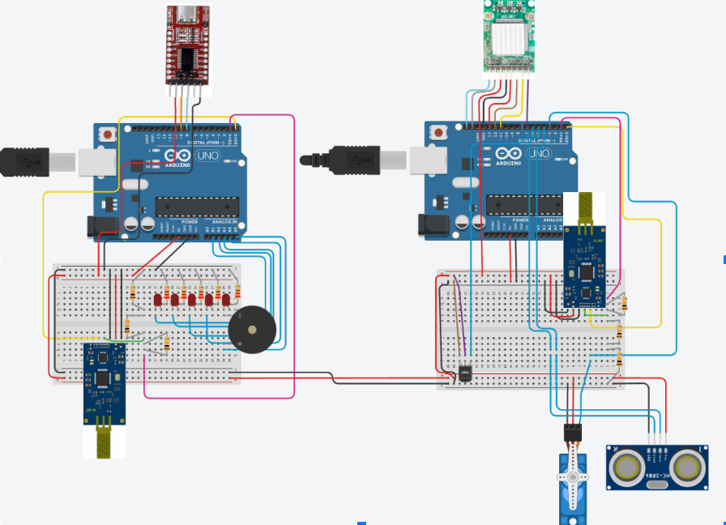

## Protocolo de comunicación 
El protocolo define cómo se intercambian datos y comandos entre el satélite (Arduino) y la estación tierra (Python GUI).
  
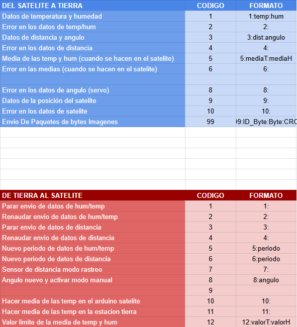


## Versiones del proyecto
### **Versión 1**  
   [Ver video](https://drive.google.com/file/d/1Z6En6WkZa4Dj-eJ62Kv3MVlINoD3yJOS/view?usp=sharing)  

El proyecto de simulación satelital comenzó con la versión 1 como un primer prototipo para establecer la comunicación entre un satélite simulado y la estación tierra. En esta etapa inicial, el satélite consistía en una placa Arduino equipada con un sensor DHT, capaz de medir temperatura y humedad en tiempo real. Los datos se transmitían mediante comunicación serial hacia nuestro ordenador, donde un programa en Python se encargaba de recibirlos y mostrarlos en una interfaz gráfica básica construida con Tkinter. La interfaz nos permitía visualizar los valores numéricos de los sensores y mostrarlos mediante gráficos sencillos generados con Matplotlib.

### **Versión 2**  
   [Ver video](https://drive.google.com/file/d/1hKNK0I4ORd2DQYQc4liZ1lFfx9cRLFUs/view?usp=sharing)  

La versión 2 marcó un avance significativo en términos de funcionalidad y experiencia de usuario. Mejoramos la interfaz gráfica para mostrar múltiples sensores simultáneamente, incluyendo temperatura, humedad y el nuevo sensor de distancia, que utilizamos junto con un servo para crear un radar capaz de medir la distancia a objetos en diferentes direcciones. Este sensor nos permitió simular el funcionamiento de un radar real, girando el servo para obtener mediciones en distintos ángulos y enviando los datos a la estación tierra para su procesamiento.  
  
Además, implementamos el cálculo de las medias de temperatura y humedad, de manera que la interfaz mostraba no solo los valores instantáneos, sino también un promedio de las lecturas a lo largo del tiempo.
Por último creamos el protocolo de aplicación que nos permite la transmisión de datos y comandos entre la estación tierra y el satélite, asegurando que la información se reciba correctamente y que los eventos se gestionen en tiempo real.
### **Versión 3**   
   [Ver video](https://drive.google.com/file/d/1fx8jCaYvltBJq02DE8GkxMYV_DyTs3j7/view?usp=sharing)  
   
Con la versión 3, completamos todas las funcionalidades principales. Combinamos la lectura simultánea de todos los sensores de temperatura, humedad y distancia con el radar completamente funcional, de manera que los cambios que realizábamos desde la interfaz se reflejaban en tiempo real en el satélite. Refinamos la interfaz gráfica, mejorando la distribución de botones, etiquetas y gráficos.  
  
Para mejorar la velocidad de comunicación entre la estación tierra y el satélite, utilizamos un módulo adaptador USB–Serial, que permitió acelerar la transmisión de datos y reducir retrasos. Además, implementamos la comunicación inalámbrica mediante LoRa, lo que nos permitió enviar y recibir datos y comandos de forma estable sin depender de conexión directa por USB.Para garantizar la integridad de los datos transmitidos, añadimos un checksum en cada mensaje, de manera que la estación tierra pudiera verificar que los datos recibidos eran correctos antes de procesarlos. Esto nos aseguró que los comandos y los datos de los sensores se recibieran sin errores, incluso con la limitación de velocidad del canal LoRa.  
  
Otra gran incorporación que hicimos fue el registro de eventos. Todos los eventos se registran en un historial dentro de la interfaz, permitiéndonos revisar qué acciones se han ejecutado y en qué momento, lo que facilita la depuración y el seguimiento del funcionamiento del sistema.  
En esta versión también incorporamos la simulación y la visualización de la órbita del satélite. Calculamos su posición en cada instante simulando su movimiento orbital y generando la representacion en una grafica.  
### **Versión 4**
[Ver video]  
  
Esta última versión, al ser un poco más compleja, la resumimos, pero para los interesados, más abajo la vamos a explicar entera. 

#### Resumen
En la versión 4, Integramos todas las funcionalidades previas y añadido mejoras importantes en comunicación, simulación de órbitas y manejo de imágenes.
Hemos implementado la comunicación entre Arduinos y con la estación de tierra utilizando pines UART y un convertidor USB–Serial FT232RL. La estación de tierra, desarrollada en Python, recibe nuestros comandos y nos permite enviar datos de manera estable y confiable.
  
También incorporamos órbitas en 3D y 2D, mostrando la trayectoria del satélite alrededor de la Tierra y su proyección sobre un plano real. Esto nos permite visualizar con precisión su posición y movimiento, combinando simulación y representación gráfica de manera realista.
  
Hemos añadido una cámara en el satélite, capaz de capturar imágenes bajo demanda. Para ello, hemos colocado dos botones físicos, “Imagen Simulada” y “Imagen Real”, que nos permiten seleccionar si enviamos una fotografía real capturada por la cámara o una imagen atomada de la base de datos del satélite europeo Copernicus, utilizada para pruebas y demostraciones cuando no se requiere una fotografía real.

Finalmente, completamos el envío de imágenes entre el satélite y la estación de tierra, transmitiendo los datos mediante la comunicación serial y procesándolos en Python. Esto simula de manera aproximada la operación de un satélite de observación real, integrando telemetría, control y transmisión de datos.

#### Explicación extensa  

1. COMUNICACIÓN  

En nuestro proyecto, la comunicación se divide en dos partes. El primer paso corresponde a la comunicación entre la estación de tierra y el ordenador, mientras que el segundo tramo es la comunicación inalámbrica entre el satélite y la estación de tierra, que se realiza mediante el kit LoRa.

Para permitir la comunicación entre el Arduino de la estación de tierra y el ordenador, se utiliza un convertidor USB–Serial (UART), concretamente un chip FT232RL. Este componente es necesario porque el ordenador trabaja con USB, mientras que el Arduino utiliza comunicación serie asíncrona. El convertidor actúa como traductor entre estos dos sistemas y permite que el software en Python pueda recibir y enviar datos correctamente.  

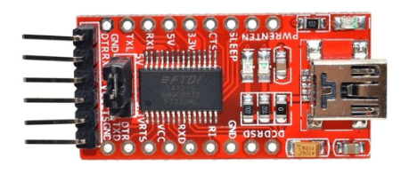  

En el montaje concreto de nuestro proyecto, los pines RX y TX (0 y 1) del Arduino no se utilizan para la comunicación directa con el ordenador, sino que están conectados al módulo LoRa. Esto hace que toda la comunicación entre el satélite y la estación de tierra dependa de las características de este sistema de radio. El LoRa está diseñado para comunicaciones de bajo consumo, lo que implica trabajar con bitrates bajos y una transmisión de datos relativamente lenta, especialmente en el envío de imágenes.

Esta limitación de velocidad no proviene de los pines RX/TX, sino del canal de radio utilizado. Si el proyecto no utilizara LoRa, o si se dispusiera de un sistema de transmisión con una antena más potente, se podría aprovechar la misma comunicación serie para enviar información a una velocidad mucho más elevada.

Finalmente, no se conectan ambos Arduinos directamente al PC mediante USB. Dado que los puertos USB de los Arduinos utilizan internamente comunicación serie, conectar ambos al mismo ordenador podría provocar conflictos y dificultar el control de la comunicación. Por este motivo, se mantiene un único enlace USB–Serial en la estación de tierra, mientras que la comunicación con el satélite se realiza exclusivamente a través del canal LoRa. Esta arquitectura permite separar claramente cada enlace y mantener un sistema estable y coherente.  
  
2.ÓRBITA 3D Y D2  

En esta parte del proyecto se ha implementado una representación visual de la órbita del satélite en dos formatos diferentes: una visualización tridimensional (3D) y una proyección bidimensional (2D) sobre un mapa real de la Tierra. Esta doble representación tiene como objetivo facilitar la comprensión del movimiento del satélite tanto desde un punto de vista espacial como geográfico.

La visualización en 3D muestra la Tierra como una esfera, utilizando un radio aproximado de 6371 km, que corresponde al radio medio real del planeta. Esta esfera actúa como referencia física y permite entender que el satélite no se mueve sobre un plano, sino que orbita. Para construir esta representación, se generan puntos sobre la superficie de una esfera mediante coordenadas paramétricas, que posteriormente se dibujan en un entorno 3D.

Estas dos representaciones también se utilizan como herramienta de seguimiento del satélite dentro de la órbita simulada. Tal como se mostrará más adelante con imágenes, el satélite calcula y simula el movimiento orbital, y estas gráficas permiten visualizar en cada momento en qué punto de la órbita se encuentra.

Esta representación tridimensional permite visualizar claramente la forma de la Tierra y comprender conceptos del espacio en el que se mueve el satélite. Aunque la órbita no está dibujada explícitamente en este fragmento, esta esfera sirve como base sobre la cual se puede representar el movimiento orbital.  

<p align="center">
  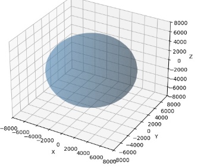
  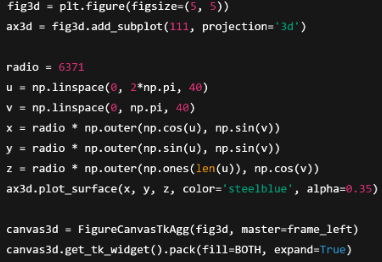
</p>
  
<p align="center">
  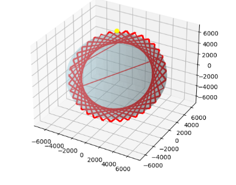
  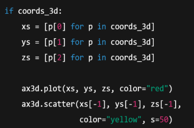
</p>  

Paralelamente, se ha implementado una segunda visualización en dos dimensiones que proyecta la posición del satélite sobre un mapa real de la Tierra. Esta proyección 2D utiliza un mapa mundial como fondo, con los ejes representando la latitud y la longitud. De este modo, se puede ver de forma directa por qué zonas del planeta pasa el satélite a lo largo del tiempo.

<p align="center">
  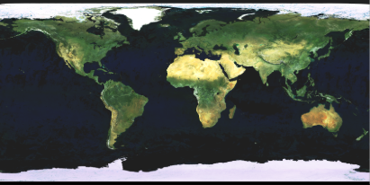
  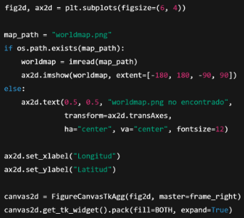
</p>  

<p align="center">
  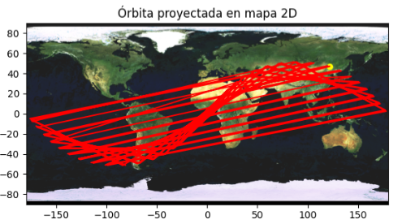
  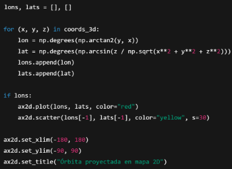
</p>  

Tal como se puede ver en las imágenes, tanto para la visualización en 3D como para la proyección en 2D, en las primeras figuras se muestra el código y el resultado de la generación del espacio. En las siguientes imágenes se puede ver la generación del trazado de la órbita, donde se representa el recorrido seguido por el satélite y se destaca su última posición. De este modo, se puede entender claramente cómo el programa construye el escenario y, a partir de este, dibuja tanto la órbita en 3D como su proyección en 2D sobre la superficie terrestre.
  
3.CÁMARA OV2640 MINI INTEGRADA EN EL SATÉLITE  


